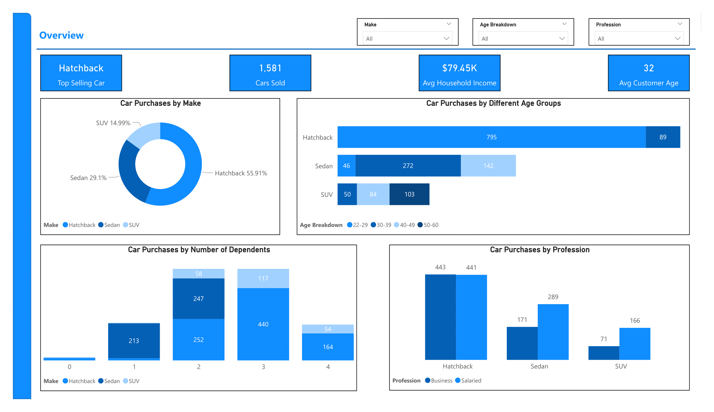
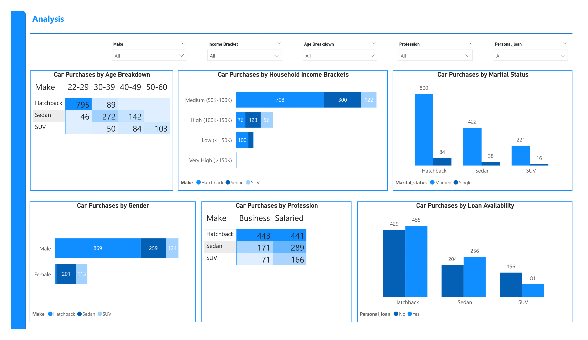

# Market Segmentation & Customer Profiling for US Automobile Market Expansion

## Table of Contents

- [Business Problem](#business-problem)
- [Rationale for the Project](#rationale-for-the-project)
- [Aim of the Project](#aim-of-the-project)
- [Data Description](#data-description)
- [Tech Stack](#tech-stack)
- [Project Scope](#project-scope)
- [Analysis and Insights](#analysis-and-insights)
- [Recommendations](#recommendations)

## Business Problem
Austo, a UK-based automobile company, aims to expand its presence into the US market after successfully establishing its business in Europe. The company seeks to understand the preferences and purchasing behaviour of US car buyers in order to adapt its strategy to this new market. To do so, Austo has contracted a consulting firm to conduct market research and collect buyer data, which will be analyzed to identify trends and customer profiles for different types of cars.

## Rationale for the Project
The US automobile market presents a significant growth opportunity for Austo. However, to succeed in this new market, it's crucial to understand local customer preferences and purchasing behaviour. This project will provide valuable insights to guide Austo's business strategy and production planning, ensuring they meet specific demand levels and identify new purchase opportunities.

## Aim of the Project
The project aims to:

- Analyze the car-buying preferences of US customers based on various demographic and financial factors.
- Create customer profiles for different types of cars (Hatchback, Sedan, SUV) to identify new purchase opportunities.
- Provide actionable insights and recommendations to help Austo adjust its business strategy and production plans to better meet US market demand.

## Data Description
The dataset consists of various demographic, financial, and car-related information of US car buyers. The data points include:

- Age: Age of the customer.
- Gender: Gender of the customer.
- Profession: Employment status (Salaried/Business).
- Marital_status: Whether the customer is married or single.
- Education: The highest level of education attained.
- No_of_dependents: Number of dependents the customer has.
- Personal_loan: Whether the customer has a personal loan.
- House_loan: Whether the customer has a house loan.
- Partner_working: Indicates if the customer's partner is employed.
- Salary: Annual income of the customer.
- Partner_salary: Annual income of the customer's partner.
- Total_salary: Combined household income.
- Price: The price of the purchased car.
- Make: Type of car (Hatchback, Sedan, SUV).

## Tech Stack
The project utilizes the following tools and technologies:

- Power BI: For data visualization, dashboard creation, and insights generation.
- DAX (Data Analysis Expressions): To perform complex calculations and measures within Power BI.
- Power Query: For data cleaning, transformation, and manipulation.

## Project Scope
The scope of the project includes:

- Data Cleaning and Transformation using Power Query.
- Data exploration and analysis to understand the key factors influencing car purchase behaviour.
- Creation of interactive Power BI dashboards that display customer profiles based on car type, income level, and other demographic factors.
- Providing insights and recommendations to Austo’s management team to aid in their market expansion strategy.

## Analysis and Insights
This report is made of of two pages:
- Overview Page
- Analysis Page

The full report can be found [here](https://app.powerbi.com/view?r=eyJrIjoiMzE2ZTNlNjktODQzNC00ZmE0LWE2NjYtZmRiZWRjZjdlYjI1IiwidCI6IjBjODQwNDRjLTRmZDUtNGU4My1iYjczLWNiYjhjNjI3OGIyZiJ9)

### Overview

This page provides a high level summary of actionable insights that management can act on at a glance.
- First, we see that Hatchbacks are the most popular Car Make, accounting for almost 56% market share of the 1,581 cars sold.
- Also, the average household income of the customers who bought these cars is $79,450.
- On the average, the customers are young adults aged 32 years.
- We see that the 22-29 age group make up the largest share of Hatchback buyers, showing the relevance of this demographic in driving Hatchback and overall sales. The 30-39 age group have a strong preference for Sedans.
- For families with 2 and 3 dependents, we observe that the overwhelming favourite is Hatchbacks, followed by Sedans. This suggests that young families that are just starting out prefer 'smaller' cars. For buyers with 1 dependent, their clear favourite is Sedans while those with 4 dependents lean towards SUVs.
- Although there is no noticable difference in the preference for Hatchbacks between buyers who are business owners and professionals who earn salaries, we see that customers who earn salaries buy more Sedans and SUVs than those who are business owners.

### Analysis

On this page, we'll take a closer look at demographic insights, loan impact, and market opportunities.
- We see that younger buyers (22-29) and those earning between 50k and 100k have a preference for Hatchbacks, with Seniors (50-60) and those earning above 150k leaning towards SUVs. Hence, we can target young buyers with affordable, practical cars and older, higher earners with luxury models like SUVs.
- Marketing efforts and strategies should be concentrated on Married customers, as they are the overwhelming majority for all Makes of cars.
- Male buyers prefer Hatchbacks, followed by Sedans, with SUVs being the least preferred. However, we see that Female customers tend to buy more Sedans, followed by SUVs. This insight highlights gender-specific marketing opportunities for Austo to tailor messaging that resonates more with each group.
- With the exception of Hatchbacks with almost equal patronage from buyers who earn a salary and customers who earn through business, customers with salaries generally buy more cars than business customers for Sedans and SUVs.
- We see that majority of buyers who opted for Hatchbacks and Sedans had personal loan, even though the numbers are not that significant. Austo can look into this and offer more competitive financing options for Hatchbacks and Sedans to attract lower-income buyers.

### Recommendations
Target Young Adults for Hatchbacks:
- The 22-29 age group is the largest buyer of Hatchbacks, and young families with 2-3 dependents also prefer this car type. Hence, focus marketing efforts on young adults and small families by promoting Hatchbacks as affordable and practical options.

Promote Sedans to Small Families and Female Buyers:
- Families with 1 dependent prefer Sedans, and female customers favour Sedans over other car types. Highlight Sedans as a family-friendly and stylish option in marketing campaigns aimed at smaller families and female buyers.

Tailor SUV Marketing to Older and High-Income Customers:
- Customers aged 50-60 and those earning above $150k show a strong preference for SUVs. Hence, promote SUVs as premium, luxurious models targeting older and higher-income buyers.

Expand Financing Options for Hatchbacks and Sedans:
- Many Hatchback and Sedan buyers rely on personal loans for their purchases, suggesting financing plays a role in these segments. Offer more attractive financing deals for Hatchbacks and Sedans to attract lower-income and loan-dependent buyers.

Prioritize Salaried and Married Buyers in Campaigns:
- Salaried buyers purchase more Sedans and SUVs, and married customers dominate car purchases across all makes. Develop targeted campaigns for salaried professionals and married couples, emphasizing reliability and family appeal.
